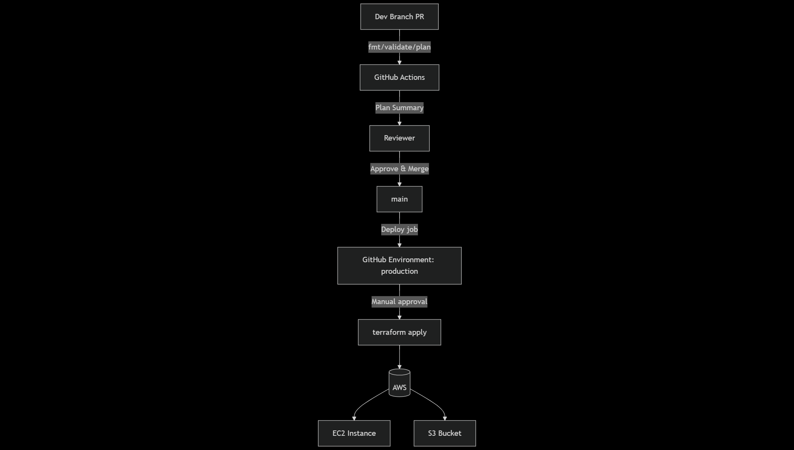

# Terraform AWS Starter — EC2 + S3 with PR Plan & Gated Apply

[](https://github.com/Simar-DevOps/aws-automation-scripts/actions/workflows/terraform.yml)


> **1-liner:** Reusable Terraform starter that plans on every PR and gates apply to **prod** via required approvals.

---

## How it works

1. **Open a PR** ➜ GitHub Actions runs `fmt` + `validate` + `plan`.
2. **Review the plan** ➜ It’s surfaced in the job summary and as an artifact.
3. **Approve + merge** to `main`.
4. **Prod apply** is gated by a **protected environment** (required reviewers). Once approved, the workflow applies.



---

## Quick start

### Prerequisites
- **Terraform** ≥ 1.6
- An AWS account and an **IAM Role** for **GitHub OIDC** (no long-lived keys)
- Optional: A remote backend (S3 + DynamoDB) for state locking

### OIDC role (high level)
- Create OIDC provider in AWS for `token.actions.githubusercontent.com`.
- Trust policy allows repo `Simar-DevOps/aws-automation-scripts` on branch `main` + `pull_request`.
- Attach least-privilege permissions for your resources (e.g., EC2/S3).

### Environment
Set these in **GitHub → Settings → Environments → `production`** (recommended) or as repository variables/secrets:
- `AWS_REGION` = `us-east-1`
- `TF_VAR_env` = `prod`
- If using backend vars, set them as needed.

### Local dev (optional)
```bash
# (from repo root)
./scripts/bootstrap.sh # init backend, providers
./scripts/plan.sh env/dev.tfvars
./scripts/apply.sh # applies the saved plan (asks for confirmation)

